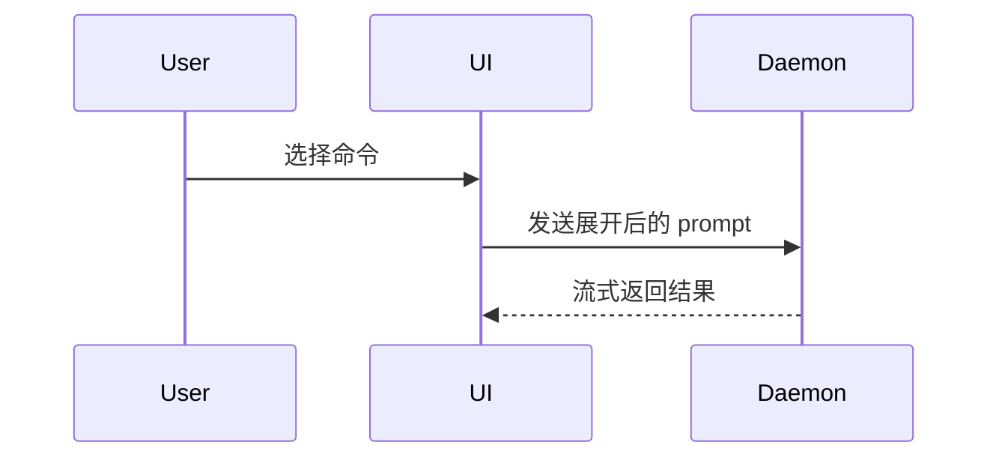

# Show Me

用简洁结论和能够说明结构的最小视觉表达解释当前主题。保持文字精炼，并将视觉内容紧邻其支撑的结论。除用户明确指定其他语言外，说明和图中自然语言标签默认使用中文。

## 选择表达形式

- 逻辑或算法使用伪代码：

```text
on(save)
  if content is unchanged
    return cached result
  write new content
  return fresh result
```

- 运行时控制流使用调用树：

```text
submitForm
  createSession
    persistPrompt
    launchAgent
  navigateToSession
```

- UI 结构使用组件树，只包含有意义的状态、hooks、props 和模块边界：

```tsx
<SessionPage> (apps/example/src/routes/session.tsx)
  useSessionEvents()
  <SessionToolbar>
    <RunSkillButton> (packages/ui)
```

- 文件职责或大范围重构使用浅层文件树：

```text
src/
|- commands/  # 解析用户操作
|- sessions/  # 管理会话状态
`- transport/ # 发送 API 请求
```

- 组件交互、控制流或数据流使用 Mermaid：



- 重点是前后变化且上下文结构已存在时，使用 `diff`。
- 仅当大部分内容都是新的、省略上下文会隐藏归属或顺序，或用户需要可直接使用的目标结构时，才展示完整代码块。
- 布局、状态对比或文字与 Mermaid 难以清晰表达的复杂概念，使用一个聚焦的 HTML 产物。单步事实或小型代码变更不创建 HTML。

## 准确性与边界

- 图中的标签、文件、函数、组件和箭头必须来自仓库或用户提供的材料，不得为了补全图而虚构实现细节。
- 保留影响结论的归属、顺序、方向和状态转换，省略无关细节。
- 如果视觉内容属于估算或概念模型，明确标注。
- 优先只使用一个视觉表达；只有每个图分别回答不同问题时才使用多个。
- 如果短段落或代码片段已经足够清楚，则不使用可视化。

## Codex 中的 HTML 产物

需要创建 HTML 产物时：

1. 选择颜色、字体、间距或组件前，检查现有产品样式或相关视觉参考。
2. 将文件写入当前 workspace，优先放在 `artifacts/` 下，并使用有意义的 `show-me-*.html` 文件名。
3. 除非 workspace 已有合适的本地 runtime，否则保持文件自包含；使用任务中的真实标签和数据。
4. 向用户提供绝对路径；存在浏览器或文件预览能力时打开并预览，不输出 Claude 专用的 `Bash(open ...)` 指令。
5. 检查桌面和窄屏宽度下的可用性；无法预览时说明限制并提供产物路径。

## 最终回复结构

先用一句话说明答案或关键关系，再放置视觉内容，最后只补充理解所需的证据、边界或下一步。确保图在纯文本中仍可读；只有 Mermaid 或 HTML 能明显改善理解时才提供替代形式。
