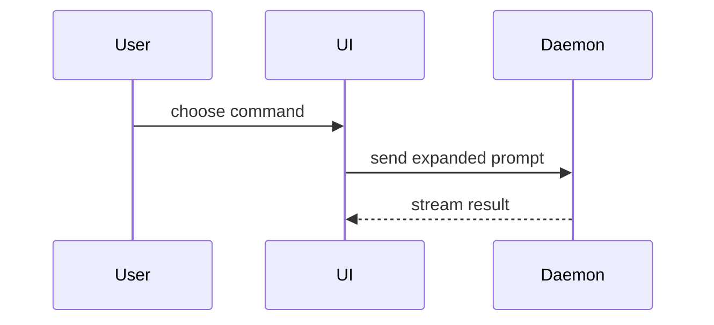

# Show Me

Explain the current topic with a concise conclusion and the smallest visual that makes its structure clear. Keep prose brief and place each visual next to the claim it supports.

## Choose the representation

- Use pseudocode for logic or an algorithm:

```text
on(save)
  if content is unchanged
    return cached result
  write new content
  return fresh result
```

- Use a call tree for runtime control flow:

```text
submitForm
  createSession
    persistPrompt
    launchAgent
  navigateToSession
```

- Use a component tree for UI structure. Include only meaningful state, hooks, props, and module boundaries:

```tsx
<SessionPage> (apps/example/src/routes/session.tsx)
  useSessionEvents()
  <SessionToolbar>
    <RunSkillButton> (packages/ui)
```

- Use a shallow file tree for file responsibility or broad refactors:

```text
src/
|- commands/  # parses user actions
|- sessions/  # owns session state
`- transport/ # sends API requests
```

- Use Mermaid for component interaction, control flow, or data flow:



- Use `diff` when the point is a before/after change and the surrounding shape already exists.
- Show a whole code block only when most of it is new, omitted context would hide ownership or order, or the user needs a copyable target shape.
- For a layout, state comparison, or concept too dense for text and Mermaid, create one focused HTML artifact. Do not create HTML for a one-step fact or a small code change.

## Accuracy and boundaries

- Ground labels, files, functions, components, and arrows in the repository or the user's supplied material. Do not invent implementation details to complete a diagram.
- Preserve ownership, ordering, direction, and state transitions that matter to the conclusion; omit incidental detail.
- If the visual is an estimate or conceptual model, label it as such.
- Prefer one visual. Use several only when each answers a different part of the question.
- If the task is already clear in a short paragraph or snippet, skip visualization.

## HTML artifacts in Codex

When an HTML artifact is justified:

1. Inspect the existing product styles or relevant visual references before choosing colors, type, spacing, or components.
2. Write the file in the current workspace, preferably under `artifacts/`, with a descriptive `show-me-*.html` name.
3. Keep it self-contained unless the workspace already has a suitable local runtime. Use real labels and data from the task.
4. Give the user the absolute file path. Open or preview it with the available browser/file-preview capability when one is available; do not emit Claude-specific `Bash(open ...)` instructions.
5. Check that the layout is usable at desktop and narrow widths. If it cannot be previewed, report that limitation and provide the artifact path.

## Final response shape

Lead with one sentence stating the answer or key relationship, then place the visual, then add only the evidence, boundary, or next action needed to interpret it. Keep diagrams readable in plain text and provide a Mermaid or HTML alternative only when it materially helps.
